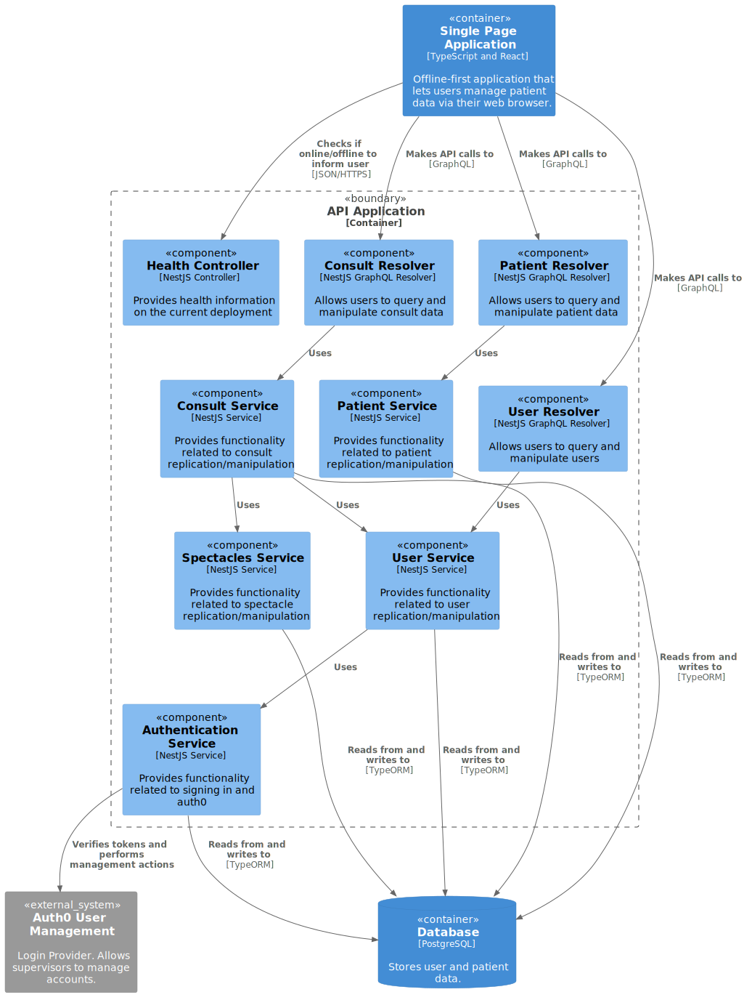

# API Application

`/SuperVision/API Application`

- [Overview](../../README.md)
  - [Deployment](../../Deployment/README.md)
  - [SuperVision](../../SuperVision/README.md)
    - [**API Application**](../../SuperVision/API%20Application/README.md)
    - [Single Page Application](../../SuperVision/Single%20Page%20Application/README.md)

---

[SuperVision (up)](../../SuperVision/README.md)

---

