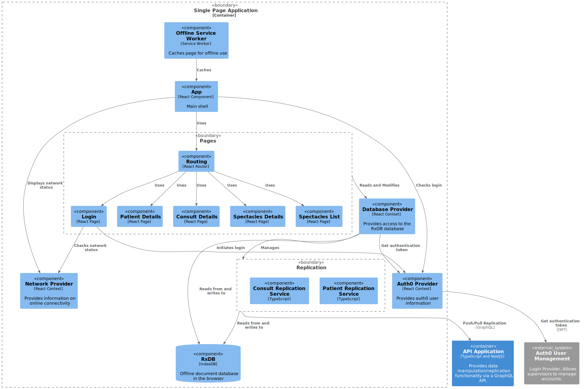

# Single Page Application

`/SuperVision/Single Page Application`

- [Overview](../../README.md)
  - [Deployment](../../Deployment/README.md)
  - [SuperVision](../../SuperVision/README.md)
    - [API Application](../../SuperVision/API%20Application/README.md)
    - [**Single Page Application**](../../SuperVision/Single%20Page%20Application/README.md)

---

[SuperVision (up)](../../SuperVision/README.md)

---

## RxDB

To achieve offline-first and synchronisation functionality, the [RxDB](https://rxdb.info)
library was chosen.

In our application, RxDB is used to store a local copy of all the data contained in
the database that relates to patients and consultations.

    This application is currently using RxDB v12.
    The documentation is for v13 and so there may be some differences

    Documentation for RxDB v12.7.16 can be found at:
    https://github.com/pubkey/rxdb/tree/fc96cc8c5b46339d345a861b33274aaa98fda54e

RxDB allows for the use of a number of different plugins for storage and replication.
We use the DexieJS plugin for storage, and GraphQL plugin for replication with our backend.

RxDB uses a Document/Collection NoSQL model.

GraphQL requests are sent at regular intervals to retrieve any documents that have been created or updated.
Each time a change is made, GraphQL requests are sent to update the backend, and retrieve the updated state from the backend.

### Collections

Our implementation includes two collections, which each replicate via their own GraphQL endpoints.
These collections represent the Patient and Consult collections on the backend.
